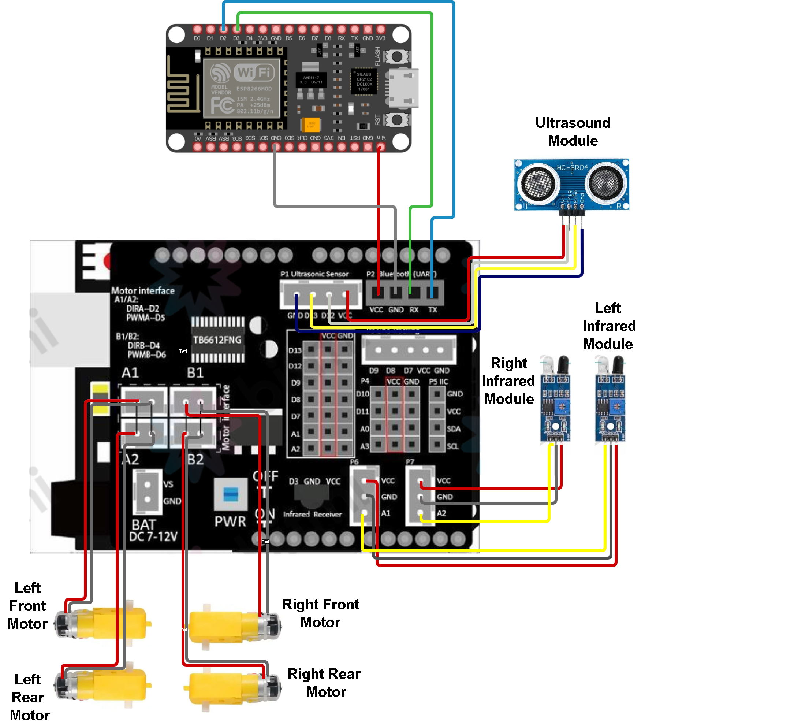

# Smart RC Car with Real-Time Telemetry

This project implements a remote-controlled robot car featuring a live telemetry system. It utilizes an **Arduino Uno** for low-level hardware control and an **ESP8266** module acting as a wireless bridge to transmit sensor data to a custom **Python dashboard** via the UDP protocol.

## System Architecture

The hardware is built around a high-efficiency **TB6612FNG-based Multi-purpose Motor Shield**. This expansion board integrates the motor driver circuitry directly, significantly reducing wiring complexity and improving power efficiency compared to traditional L298N modules.

### Hardware Components:
* **Microcontrollers**: Arduino Uno (Logic Layer) and ESP8266 NodeMCU (Communication Layer).
* **Motor Driver**: Integrated TB6612FNG Dual DC Motor Driver.
* **Sensing**: 
    * HC-SR04 Ultrasonic Sensor for front distance measurement.
    * Dual Infrared (IR) Obstacle Sensors for lateral detection.
* **Power**: 7-12V DC input with an onboard power switch for battery management.

## Connectivity Mapping
The system uses a decentralized communication strategy to ensure low latency:

* **P1 Port**: HC-SR04 Ultrasonic Sensor .
* **P6 & P7 Ports**: IR Obstacle Sensors (Mapped to Analog pins A1 & A2).
* **P2 (UART) Port**: Serial bridge between Arduino and ESP8266.
    * Arduino TX -> ESP8266 D2 (RX)
    * Arduino RX -> ESP8266 D3 (TX)
* **Common Ground**: Established through the expansion shield to ensure signal integrity.

## Software & Protocols
* **Telemetry (M2M)**: Arduino sends raw sensor strings to the ESP8266, which parses them into **JSON** format.
* **Wireless Transmission**: Data is broadcasted over Wi-Fi using the **UDP (User Datagram Protocol)** for near-instantaneous updates.
* **Python Dashboard**: A Pygame-based GUI that renders live telemetry and captures keyboard interrupts for vehicle control.
* **Safety Logic**: Implements a "Dead-man's switch" behavior; the vehicle only moves while keys are actively pressed and halts immediately upon release.

## Getting Started
1.  **Hardware**: Mount the TB6612 shield onto the Arduino Uno and connect sensors according to the provided diagram.
2.  **Firmware**: 
    * Upload the Arduino sketch to the Uno.
    * Update the Wi-Fi credentials and Laptop IP in the ESP8266 sketch, then upload.
3.  **Software**:
    * Ensure Python 3.x is installed.
    * Install requirements: `pip install pygame`.
    * Update the `ESP_IP` in the Python script to match the address shown in the Serial Monitor.
4.  **Execution**: Run the Python script and use **WASD** keys to navigate.

## Technical Advantages
By leveraging the TB6612FNG driver and a dedicated Wi-Fi bridge, this architecture separates motor noise from the communication logic, resulting in a more stable and responsive robotics platform compared to single-board solutions.
